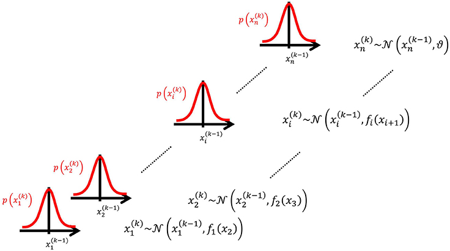
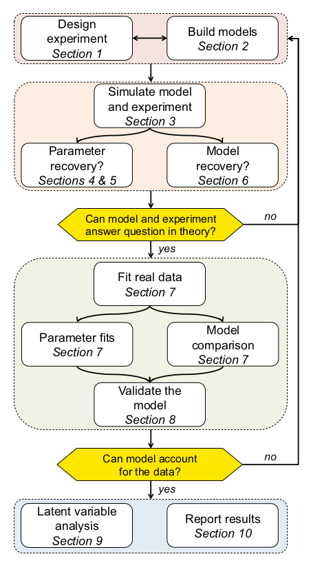
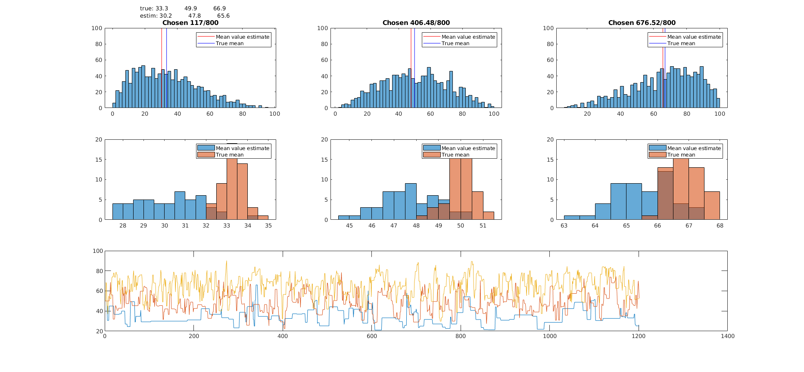
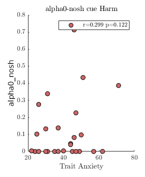
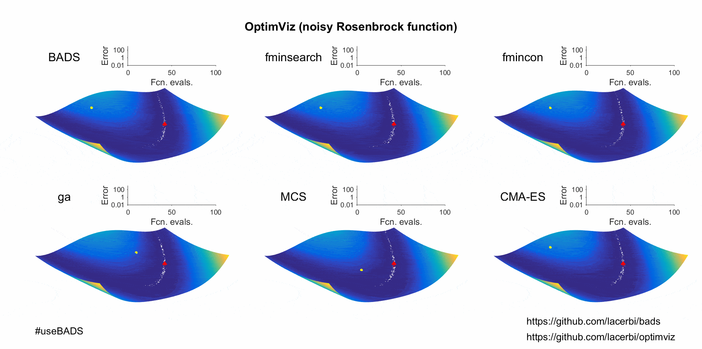
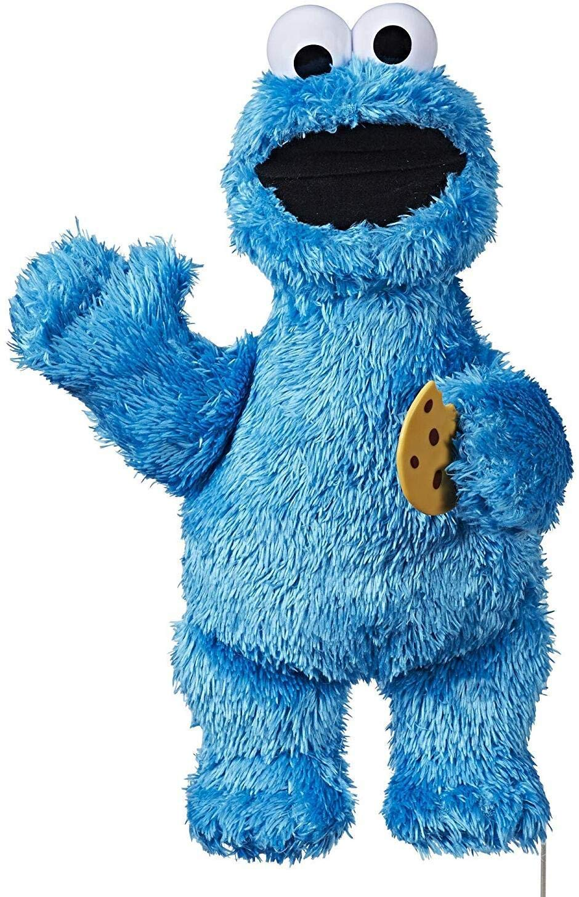

class: center, middle
<table><tr>
<td></td>
<td></td>
</tr></table>
## Computational models: who ate all the cookies?
 Mar 18th, 2020

###Ondrej Zika    

Schuck Lab, Max Planck Institute for Human Development, Berlin

---

### Overview
1. Introduction to models
2. The benefits
3. The pitfalls
4. Ten great practices when using models
5. Example and practical steps: Is Christoph really responsible low cookie amounts?!

---

class: left,
name: standard-slide

## What are computational models?
- mathematically formulated hypotheses, processes, relationships  

#### Rescorla-Wagner
- for example, the Tom Hanks of learning models:
$$V_{t+1} = V_t + \alpha(R_t - V_t)$$
- allows us to track the value of a stimulus given the rewards and a latent parameter `\(\alpha \)`, the learning rate.

#### Hierarchical Gaussian Filter
- also tracks the value of a stimulus, but uses risk and volatility estimates to do so    

---

### The benefits/promises
  - they eliminate ambiguity in theory definition
  - data prediction
  - latent variables inference (especially in psychology/neuroscience)
  - understand processes that underlie behaviour
  - understanding how drugs/psychiatric diseases impact cognition
  - to make better sense of noisy data - we don't have to rely on averaging
  - to infer how observed data were generated

---

### The pitfalls
  - models can be badly specified, e.g. they make predictions outside of natural ranges,  
   parameters are dependent, they overfit
  - fitting can go wrong and we might make incorrect inference
  - we can only draw conclusions from explicitly compared models
  - what if all compared models are bad?
  - do models actually add anything or are they just degrees-of-freedom supernovas?

---

### Ten good practices in computational modeling (Wilson and Collins, 2019)

---

### 1. Design a good experiment
 - models don't replace a good experiment
 - a model is not a magic box that infers what the experiment wasn't designed for
 - it makes work much stronger if behavioral signature is present

---

### 2. Design good models
#### Ways to define a model:
 - translate a cognitive model to math
 - see what AI/ML people are up to
 - Bayes-optimal (normative) models

#### Tips for model design:
 - make model as simple as possible, but not simpler
 - make it interpretable
 - models should be formulated for ALL hypotheses that might compete with your H1

---

### 3. Simulate
 - simulate data and perform basic analyses on them to assess how sensitive is your design
 - this can really inform your decisions
 - find qualitative signatures of the model
 - simulate across the range of possible values
 - visualize different predictions made by different models

---

### 4. Fit the parameters
 - foresee the likelihood space - are there any possible Infs/NaNs?
 - select parameter bounds properly
 - if many estimates are at bounds, consider re-parametrizing,   
 increasing number of trials etc.
 - beware local minima - start the optimization many times with different starting positions  

---

---

### 5. Parameter recovery
- fit simulated data across range of parameter values and  
compare how well the estimates compare to inputs
- deterministic vs stochastic models
- make sure simulated parameters are in the right range
- check for pre-post correlation but also correlation with other parameters (are parameters unique?)
- remember that parameter recovery represents a best-case scenario
- consider the identifiability of the parameters `\(\alpha\)` and `\(\zeta\)`   

$$x = \alpha * (\zeta - t)$$

---

### 6. Can different models be dissociated by fitting: model recovery
- simulate both models and do model comparison on simulated data
- compare different model comparison methods:
BIC/AIC, cross validation, model evidence
- model comparison only tells us which model fits best from the **considered MODELS**  
 (it's possible that the best model is really rubbish)

 | | Likelihood-based   |      RSS-based      |
 |----|----------|:-------------:|
 | AIC | $$2k - 2ln(\hat{L})$$ |  $$nln(RSS/n) +2k$$ |
 | AICc | $$ AIC + \frac{2k^2 + 2k}{n - k - 1} $$ |    |
 | BIC | $$ln(n)k - 2ln(\hat{L})$$ | $$nln(RSS/n) + kln(n)$$ |

---

### 7. Run experiment and analyze the data
- analyze data without the model
- human behavior is always more complicated than model-generated one

---

### 8. Validate the winning model
- is the winning model actually good, or just least bad?
- average trial error/likelihood - is it reasonable?
- perform posterior predictive check
- qualitative and quantitative analysis

---

### 9. Analyze the winning model
- latent vars can be used as a new measure
- model fits can be used to assess group differences in best models

---

### 10. Report
- model selection
- confusion matrix
- number of subjects best fitted by a the winning model
- parameter recovery
- parameter estimates
- share data and code!

---

### How much does Christoph really contribute to cookie disappearance?
- the my last talk I assumed that if there are cookies on the table they disappear at the rate:  
$$\lambda_{ch} = 3 c/hr$$

$$\lambda_{noch} = 0.2 c/hr$$  

- to assess whether I was unfair I secretly collected data over the past 120 days
- and I built two model to assess the true rate

---

### How much does Christoph really contribute to cookie disappearance?
#### Model 1
**Hypothesis:** Christoph's presence influences the cookie consumption rate
- this model will be pickup on whether Christoph's presence plays a role
- free parameters: 2
- parameter ranges:  `\( \lambda_{ch,noch} \in [0, 10]\)`
- model:  

if Christoph in lab:  `\(C_{evening} = C_{morning} - \lambda_{ch}*t\)`

if NO Christoph:   `\(C_{evening} = C_{morning} - \lambda_{noch}*t\)`

---

### How much does Christoph really contribute to cookie disappearance?
#### Model 2
**Hypothesis:** amount of consumed cookies is driven by how hungry the lab is
- free parameters: 3 (`\(\alpha, \beta,  s_0\)`)
- lab has some general hourly munching rate  `\(\alpha \in [0,10]\)`
- lab metabolism `\(\beta \in [0.3,1]\)` represents how quickly our stomachs process food from previous days (low value means slow metabolism)
- lab satiety parameter `\(s\)` is updated each day `\(d\)` day using: `\(s_{d} = s_{d-1} + \beta ( \frac{(C_{morning} - C_{evening}}{30} - s_{d-1} ) \)`
- `\(s_0\)` corresponds to starting satiety on day 1
- `\(C_{d,evening} = C_{d,morning} - (1-s_{d})\alpha t\)`

---

